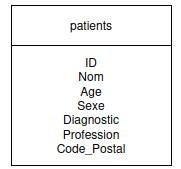

# TP Privacy Database

**Cours :** Sécurité 2025–2026  
**Auteurs :** Maxime Vimpere, Raphaël Lacôte, Samuel Bérion  

---

## Contexte

Ce TP a pour but d’illustrer les **risques liés au partage d’une base de données** et de présenter certaines **techniques d’anonymisation** permettant un partage plus sécurisé.

Par exemple, lorsqu'une base de données est **diffusée**, il faut garantir que les individus ne puissent pas être **réidentifiés**, même après suppression des identifiants directs. La k-anonymisation consiste à rendre chaque individu **indiscernable** parmi au moins **k autres**.

Les exercices s’appuient sur les différentes méthodes connues pour améliorer l'anonymisation d'une base de données.

Vous disposez :
- d’une **base de données** (*patients.db*);

Précision : le champs **Nom** contient la concaténation du *prenom* et du *nom* dans cet ordre.

- d’un **script Python** permettant d’interagir avec celle-ci. (*search_database.py*)

Votre rôle est de **modifier le script Python** selon les besoins des exercices.

> **Important :** Vous n’aurez jamais besoin d’interagir directement avec la base de données (*par sqlite3 ou autres*).

---

## Exercice 1 — K-Anonymity

[Rappel sur K-Anonymity](https://en.wikipedia.org/wiki/K-anonymity)

1. Vous savez qu’un certain monsieur **Geneva Preston** est présent dans la base de données.  
   À l’aide du script Python, donnez le **diagnostic** médical de monsieur *Geneva Preston* ?
   > **Important :** Le champ **Nom** dans la base de données est un **identifiant** car il permet d’identifier une personne à l’aide de cette seule information (*Prenom Nom*).

2. Modifier le script (*search_database.py*) pour rendre l’identification par la recherche d’un individu plus compliquée et **expliquez votre démarche**.

3. Maintenant que vous avez modifié le fichier, monsieur **Geneva Preston** n’est désormais plus identifiable par son nom.  
   Cependant, en tant que personne malveillante, vous savez qu’il est un **homme (M)** de **24 ans** et que son métier est **Ingenieur**.  
   À l’aide de ces informations, retrouvez le **diagnostic de monsieur Geneva Preston**.

4. En vous basant sur les principes de **K-Anonymity**, expliquez comment vous auriez rendu les individus moins **identifiable** via un attribut *anonymable*.

---

## Exercice 2 — L-Diversity

[Rappel sur L-Diversity](https://en.wikipedia.org/wiki/L-diversity)

1. Monsieur **Geneva Preston** est désormais introuvable dans la base de données.  
   Cependant, vous savez qu’il **fait partie de cette base** :  
   que pouvez-vous deviner de son **diagnostic médical** ? Pourquoi ?

2. En vous basant sur les principes de **L-Diversity**, expliquez comment vous renderiez le **diagnostic** de personnes comme monsieur *Geneva Preston* **moins devinable**.

---

### *Exercice 3 — Differential Privacy - BONUS*

[Rappel sur Differential Privacy](https://en.wikipedia.org/wiki/Differential_privacy)

1. À l’aide d’une nouvelle fonction, trouvez **combien de personnes sont atteintes d’une grippe** dans la base de données.  

2. À partir du **nombre de lignes retournées** par une requête, pouvez-vous déterminer si monsieur *Geneva Preston* est atteint d’une grippe ?  

3. Vous avez désormais trouvé une **manière détournée de récolter des informations** sur quelqu’un.  
   Trouvez une façon **d’empêcher ce genre d’attaque**, implémentez cette solution et **vérifiez qu’il n’est plus possible** d’obtenir ces informations.  

---

